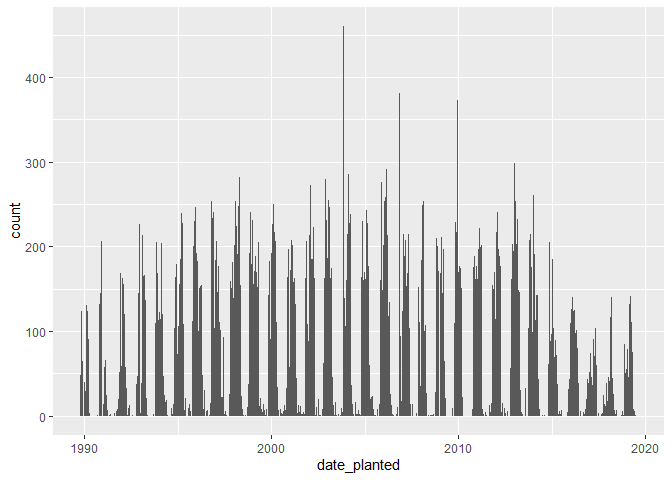
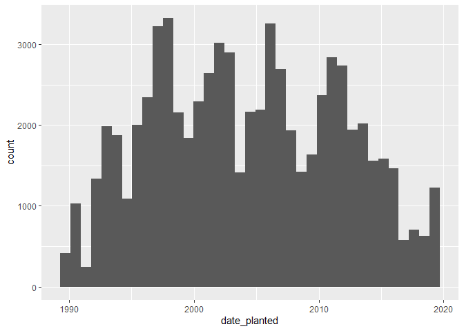

Mini Data-Analysis Deliverable 1
================

# Welcome to your (maybe) first-ever data analysis project!

And hopefully the first of many. Let’s get started:

1.  Install the [`datateachr`](https://github.com/UBC-MDS/datateachr)
    package by typing the following into your **R terminal**:

<!-- -->

    install.packages("devtools")
    devtools::install_github("UBC-MDS/datateachr")

2.  Load the packages below.

``` r
library(datateachr)
library(tidyverse)
```

    ## Warning: package 'tidyverse' was built under R version 4.1.3

    ## -- Attaching packages --------------------------------------- tidyverse 1.3.2 --
    ## v ggplot2 3.3.5     v purrr   0.3.4
    ## v tibble  3.1.6     v dplyr   1.0.7
    ## v tidyr   1.1.4     v stringr 1.4.1
    ## v readr   2.1.1     v forcats 0.5.1

    ## Warning: package 'stringr' was built under R version 4.1.3

    ## -- Conflicts ------------------------------------------ tidyverse_conflicts() --
    ## x dplyr::filter() masks stats::filter()
    ## x dplyr::lag()    masks stats::lag()

3.  Make a repository in the <https://github.com/stat545ubc-2022>
    Organization. You will be working with this repository for the
    entire data analysis project. You can either make it public, or make
    it private and add the TA’s and Lucy as collaborators. A link to
    help you create a private repository is available on the
    \#collaborative-project Slack channel.

# Instructions

## For Both Milestones

-   Each milestone is worth 45 points. The number of points allocated to
    each task will be annotated within each deliverable. Tasks that are
    more challenging will often be allocated more points.

-   10 points will be allocated to the reproducibility, cleanliness, and
    coherence of the overall analysis. While the two milestones will be
    submitted as independent deliverables, the analysis itself is a
    continuum - think of it as two chapters to a story. Each chapter, or
    in this case, portion of your analysis, should be easily followed
    through by someone unfamiliar with the content.
    [Here](https://swcarpentry.github.io/r-novice-inflammation/06-best-practices-R/)
    is a good resource for what constitutes “good code”. Learning good
    coding practices early in your career will save you hassle later on!

## For Milestone 1

**To complete this milestone**, edit [this very `.Rmd`
file](https://raw.githubusercontent.com/UBC-STAT/stat545.stat.ubc.ca/master/content/mini-project/mini-project-1.Rmd)
directly. Fill in the sections that are tagged with
`<!--- start your work below --->`.

**To submit this milestone**, make sure to knit this `.Rmd` file to an
`.md` file by changing the YAML output settings from
`output: html_document` to `output: github_document`. Commit and push
all of your work to the mini-analysis GitHub repository you made
earlier, and tag a release on GitHub. Then, submit a link to your tagged
release on canvas.

**Points**: This milestone is worth 45 points: 43 for your analysis, 1
point for having your Milestone 1 document knit error-free, and 1 point
for tagging your release on Github.

# Learning Objectives

By the end of this milestone, you should:

-   Become familiar with your dataset of choosing
-   Select 4 questions that you would like to answer with your data
-   Generate a reproducible and clear report using R Markdown
-   Become familiar with manipulating and summarizing your data in
    tibbles using `dplyr`, with a research question in mind.

# Task 1: Choose your favorite dataset (10 points)

The `datateachr` package by Hayley Boyce and Jordan Bourak currently
composed of 7 semi-tidy datasets for educational purposes. Here is a
brief description of each dataset:

-   *apt_buildings*: Acquired courtesy of The City of Toronto’s Open
    Data Portal. It currently has 3455 rows and 37 columns.

-   *building_permits*: Acquired courtesy of The City of Vancouver’s
    Open Data Portal. It currently has 20680 rows and 14 columns.

-   *cancer_sample*: Acquired courtesy of UCI Machine Learning
    Repository. It currently has 569 rows and 32 columns.

-   *flow_sample*: Acquired courtesy of The Government of Canada’s
    Historical Hydrometric Database. It currently has 218 rows and 7
    columns.

-   *parking_meters*: Acquired courtesy of The City of Vancouver’s Open
    Data Portal. It currently has 10032 rows and 22 columns.

-   *steam_games*: Acquired courtesy of Kaggle. It currently has 40833
    rows and 21 columns.

-   *vancouver_trees*: Acquired courtesy of The City of Vancouver’s Open
    Data Portal. It currently has 146611 rows and 20 columns.

**Things to keep in mind**

-   We hope that this project will serve as practice for carrying our
    your own *independent* data analysis. Remember to comment your code,
    be explicit about what you are doing, and write notes in this
    markdown document when you feel that context is required. As you
    advance in the project, prompts and hints to do this will be
    diminished - it’ll be up to you!

-   Before choosing a dataset, you should always keep in mind **your
    goal**, or in other ways, *what you wish to achieve with this data*.
    This mini data-analysis project focuses on *data wrangling*,
    *tidying*, and *visualization*. In short, it’s a way for you to get
    your feet wet with exploring data on your own.

And that is exactly the first thing that you will do!

1.1 Out of the 7 datasets available in the `datateachr` package, choose
**4** that appeal to you based on their description. Write your choices
below:

**Note**: We encourage you to use the ones in the `datateachr` package,
but if you have a dataset that you’d really like to use, you can include
it here. But, please check with a member of the teaching team to see
whether the dataset is of appropriate complexity. Also, include a
**brief** description of the dataset here to help the teaching team
understand your data.

<!-------------------------- Start your work below ---------------------------->

1: apt_buildings 2: cancer_sample 3: flow_sample 4: vancouver_trees

<!----------------------------------------------------------------------------->

1.2 One way to narrowing down your selection is to *explore* the
datasets. Use your knowledge of dplyr to find out at least *3*
attributes about each of these datasets (an attribute is something such
as number of rows, variables, class type…). The goal here is to have an
idea of *what the data looks like*.

*Hint:* This is one of those times when you should think about the
cleanliness of your analysis. I added a single code chunk for you below,
but do you want to use more than one? Would you like to write more
comments outside of the code chunk?

<!-------------------------- Start your work below ---------------------------->

``` r
#apt_buildings
nrow(apt_buildings)
```

    ## [1] 3455

``` r
ncol(apt_buildings)
```

    ## [1] 37

``` r
class(apt_buildings)
```

    ## [1] "tbl_df"     "tbl"        "data.frame"

``` r
#cancer_sample
nrow(cancer_sample)
```

    ## [1] 569

``` r
ncol(cancer_sample)
```

    ## [1] 32

``` r
class(cancer_sample)
```

    ## [1] "spec_tbl_df" "tbl_df"      "tbl"         "data.frame"

``` r
#flow_sample
nrow(flow_sample)
```

    ## [1] 218

``` r
ncol(flow_sample)
```

    ## [1] 7

``` r
class(flow_sample)
```

    ## [1] "tbl_df"     "tbl"        "data.frame"

``` r
#vancouver_trees
nrow(vancouver_trees)
```

    ## [1] 146611

``` r
ncol(vancouver_trees)
```

    ## [1] 20

``` r
class(vancouver_trees)
```

    ## [1] "tbl_df"     "tbl"        "data.frame"

<!----------------------------------------------------------------------------->

1.3 Now that you’ve explored the 4 datasets that you were initially most
interested in, let’s narrow it down to 2. What lead you to choose these
2? Briefly explain your choices below, and feel free to include any code
in your explanation.
<!-------------------------- Start your work below ---------------------------->
*I am choosing the vancouver_trees and apt_buildings datasets, because
they both seem to have very thorough data with quite a few variables,
and I think it would be interesting to look at data involving attributes
of the city.*
<!----------------------------------------------------------------------------->

1.4 Time for the final decision! Going back to the beginning, it’s
important to have an *end goal* in mind. For example, if I had chosen
the `titanic` dataset for my project, I might’ve wanted to explore the
relationship between survival and other variables. Try to think of 1
research question that you would want to answer with each dataset. Note
them down below, and make your final choice based on what seems more
interesting to you!

<!-------------------------- Start your work below ---------------------------->

*I am choosing the vancouver_trees dataset. I am interested in ecology
and have taken classes in urban horticulture, and I found it to be a
very interesting topic, for which I have a lot of questions. For
example, I could research which neighbourhoods have the most trees and
the largest trees, and whether there is a difference in species
composition in different neighbourhoods.*

<!----------------------------------------------------------------------------->

# Important note

Read Tasks 2 and 3 *fully* before starting to complete either of them.
Probably also a good point to grab a coffee to get ready for the fun
part!

This project is semi-guided, but meant to be *independent*. For this
reason, you will complete tasks 2 and 3 below (under the **START HERE**
mark) as if you were writing your own exploratory data analysis report,
and this guidance never existed! Feel free to add a brief introduction
section to your project, format the document with markdown syntax as you
deem appropriate, and structure the analysis as you deem appropriate.
Remember, marks will be awarded for completion of the 4 tasks, but 10
points of the whole project are allocated to a reproducible and clean
analysis. If you feel lost, you can find a sample data analysis
[here](https://www.kaggle.com/headsortails/tidy-titarnic) to have a
better idea. However, bear in mind that it is **just an example** and
you will not be required to have that level of complexity in your
project.

# Task 2: Exploring your dataset (15 points)

If we rewind and go back to the learning objectives, you’ll see that by
the end of this deliverable, you should have formulated *4* research
questions about your data that you may want to answer during your
project. However, it may be handy to do some more exploration on your
dataset of choice before creating these questions - by looking at the
data, you may get more ideas. **Before you start this task, read all
instructions carefully until you reach START HERE under Task 3**.

2.1 Complete *4 out of the following 8 exercises* to dive deeper into
your data. All datasets are different and therefore, not all of these
tasks may make sense for your data - which is why you should only answer
*4*. Use *dplyr* and *ggplot*.

1.  Plot the distribution of a numeric variable.
2.  Create a new variable based on other variables in your data (only if
    it makes sense)
3.  Investigate how many missing values there are per variable. Can you
    find a way to plot this?
4.  Explore the relationship between 2 variables in a plot.
5.  Filter observations in your data according to your own criteria.
    Think of what you’d like to explore - again, if this was the
    `titanic` dataset, I may want to narrow my search down to passengers
    born in a particular year…
6.  Use a boxplot to look at the frequency of different observations
    within a single variable. You can do this for more than one variable
    if you wish!
7.  Make a new tibble with a subset of your data, with variables and
    observations that you are interested in exploring.
8.  Use a density plot to explore any of your variables (that are
    suitable for this type of plot).

2.2 For each of the 4 exercises that you complete, provide a *brief
explanation* of why you chose that exercise in relation to your data (in
other words, why does it make sense to do that?), and sufficient
comments for a reader to understand your reasoning and code.

<!-------------------------- Start your work below ---------------------------->

2.  I’m adding a new variable that combines the genus and species names
    for each tree. This will allow for easier species-specific
    identification of trees.

``` r
(vantrees_sciname <- 
  vancouver_trees %>%
  mutate(scientific_name = paste(genus_name, species_name)) %>% #adding the new column by concatenating genus and species
  select(tree_id:cultivar_name, scientific_name, common_name:latitude)) #reordering so that scientific name comes before common name
```

    ## # A tibble: 146,611 x 21
    ##    tree_id civic_number std_st~1 genus~2 speci~3 culti~4 scien~5 commo~6 assig~7
    ##      <dbl>        <dbl> <chr>    <chr>   <chr>   <chr>   <chr>   <chr>   <chr>  
    ##  1  149556          494 W 58TH ~ ULMUS   AMERIC~ BRANDON ULMUS ~ BRANDO~ N      
    ##  2  149563          450 W 58TH ~ ZELKOVA SERRATA <NA>    ZELKOV~ JAPANE~ N      
    ##  3  149579         4994 WINDSOR~ STYRAX  JAPONI~ <NA>    STYRAX~ JAPANE~ N      
    ##  4  149590          858 E 39TH ~ FRAXIN~ AMERIC~ AUTUMN~ FRAXIN~ AUTUMN~ Y      
    ##  5  149604         5032 WINDSOR~ ACER    CAMPES~ <NA>    ACER C~ HEDGE ~ N      
    ##  6  149616          585 W 61ST ~ PYRUS   CALLER~ CHANTI~ PYRUS ~ CHANTI~ N      
    ##  7  149617         4909 SHERBRO~ ACER    PLATAN~ COLUMN~ ACER P~ COLUMN~ N      
    ##  8  149618         4925 SHERBRO~ ACER    PLATAN~ COLUMN~ ACER P~ COLUMN~ N      
    ##  9  149619         4969 SHERBRO~ ACER    PLATAN~ COLUMN~ ACER P~ COLUMN~ N      
    ## 10  149625          720 E 39TH ~ FRAXIN~ AMERIC~ AUTUMN~ FRAXIN~ AUTUMN~ N      
    ## # ... with 146,601 more rows, 12 more variables: root_barrier <chr>,
    ## #   plant_area <chr>, on_street_block <dbl>, on_street <chr>,
    ## #   neighbourhood_name <chr>, street_side_name <chr>, height_range_id <dbl>,
    ## #   diameter <dbl>, curb <chr>, date_planted <date>, longitude <dbl>,
    ## #   latitude <dbl>, and abbreviated variable names 1: std_street,
    ## #   2: genus_name, 3: species_name, 4: cultivar_name, 5: scientific_name,
    ## #   6: common_name, 7: assigned

4.  Here I am exploring the average tree diameter in each neighbourhood.
    Diameter is a size measure for trees and is a good proxy for the
    size/age of trees. This plot allows us to start to understand which
    neighbourhoods have larger trees.

``` r
(vantrees_sciname %>%
  group_by(neighbourhood_name) %>%
  summarise(mean_diam = mean(diameter)) %>% #summarising first so that I can easily reorder the columns by mean diameter
  ggplot(aes(x=reorder(neighbourhood_name, +mean_diam), mean_diam))+
  geom_col() +
  coord_flip())  #flipping the axes so we can read the neighbourhood names better
```

<!-- -->

5.  Here I’m filtering by the genuses for Elm and Maple trees. These
    genuses are specifically interesting because they are the tree types
    most impacted by the japanese beetle, which is an invasive pest in
    Vancouver. This subset of the data could help us understand which
    neighbourhoods are most at risk for invasion of the japanese beetle.

``` r
(vantrees_elmmaple <-
  vantrees_sciname %>%
  filter(genus_name == "ULMUS" | genus_name == "ACER"))
```

    ## # A tibble: 38,923 x 21
    ##    tree_id civic_number std_st~1 genus~2 speci~3 culti~4 scien~5 commo~6 assig~7
    ##      <dbl>        <dbl> <chr>    <chr>   <chr>   <chr>   <chr>   <chr>   <chr>  
    ##  1  149556          494 W 58TH ~ ULMUS   AMERIC~ BRANDON ULMUS ~ BRANDO~ N      
    ##  2  149604         5032 WINDSOR~ ACER    CAMPES~ <NA>    ACER C~ HEDGE ~ N      
    ##  3  149617         4909 SHERBRO~ ACER    PLATAN~ COLUMN~ ACER P~ COLUMN~ N      
    ##  4  149618         4925 SHERBRO~ ACER    PLATAN~ COLUMN~ ACER P~ COLUMN~ N      
    ##  5  149619         4969 SHERBRO~ ACER    PLATAN~ COLUMN~ ACER P~ COLUMN~ N      
    ##  6  149640         6968 SELKIRK~ ACER    PLATAN~ COLUMN~ ACER P~ COLUMN~ N      
    ##  7  149680         5311 WINDSOR~ ACER    CAMPES~ <NA>    ACER C~ HEDGE ~ N      
    ##  8  149683         7011 SELKIRK~ ACER    PLATAN~ COLUMN~ ACER P~ COLUMN~ N      
    ##  9  149684         1223 W 54TH ~ ACER    PLATAN~ COLUMN~ ACER P~ COLUMN~ N      
    ## 10  149686         5007 WINDSOR~ ACER    CAMPES~ <NA>    ACER C~ HEDGE ~ N      
    ## # ... with 38,913 more rows, 12 more variables: root_barrier <chr>,
    ## #   plant_area <chr>, on_street_block <dbl>, on_street <chr>,
    ## #   neighbourhood_name <chr>, street_side_name <chr>, height_range_id <dbl>,
    ## #   diameter <dbl>, curb <chr>, date_planted <date>, longitude <dbl>,
    ## #   latitude <dbl>, and abbreviated variable names 1: std_street,
    ## #   2: genus_name, 3: species_name, 4: cultivar_name, 5: scientific_name,
    ## #   6: common_name, 7: assigned

6.  Looking at the frequency of tree diameters for the Ulmus and Acer
    genuses. This helps us start to understand the distribution of
    ages/sizes for these types of trees.

``` r
(vantrees_elmmaple %>%
  ggplot(aes(genus_name, diameter)) +
  geom_boxplot() +
  scale_y_continuous(trans='log10')) #log transforming the data so we can see the plots better
```

    ## Warning: Transformation introduced infinite values in continuous y-axis

    ## Warning: Removed 17 rows containing non-finite values (stat_boxplot).

<!-- -->

<!----------------------------------------------------------------------------->

# Task 3: Write your research questions (5 points)

So far, you have chosen a dataset and gotten familiar with it through
exploring the data. Now it’s time to figure out 4 research questions
that you would like to answer with your data! Write the 4 questions and
any additional comments at the end of this deliverable. These questions
are not necessarily set in stone - TAs will review them and give you
feedback; therefore, you may choose to pursue them as they are for the
rest of the project, or make modifications!

<!--- *****START HERE***** --->

1.  Which neighbourhoods have the highest tree species diversity?
2.  Which neighbourhoods have the most Elm and Maple trees, in total
    count and in proportion to the neighbourhood’s size?
3.  How has the amount of trees planted in Vancouver changed through
    time?
4.  How does the planting environment (Root barrier presence, planting
    area type) impact tree size?

# Task 4: Process and summarize your data (13 points)

From Task 2, you should have an idea of the basic structure of your
dataset (e.g. number of rows and columns, class types, etc.). Here, we
will start investigating your data more in-depth using various data
manipulation functions.

### 1.1 (10 points)

Now, for each of your four research questions, choose one task from
options 1-4 (summarizing), and one other task from 4-8 (graphing). You
should have 2 tasks done for each research question (8 total). Make sure
it makes sense to do them! (e.g. don’t use a numerical variables for a
task that needs a categorical variable.). Comment on why each task helps
(or doesn’t!) answer the corresponding research question.

Ensure that the output of each operation is printed!

**Summarizing:**

1.  Compute the *range*, *mean*, and *two other summary statistics* of
    **one numerical variable** across the groups of **one categorical
    variable** from your data.
2.  Compute the number of observations for at least one of your
    categorical variables. Do not use the function `table()`!
3.  Create a categorical variable with 3 or more groups from an existing
    numerical variable. You can use this new variable in the other
    tasks! *An example: age in years into “child, teen, adult, senior”.*
4.  Based on two categorical variables, calculate two summary statistics
    of your choosing.

**Graphing:**

5.  Create a graph out of summarized variables that has at least two
    geom layers.
6.  Create a graph of your choosing, make one of the axes logarithmic,
    and format the axes labels so that they are “pretty” or easier to
    read.
7.  Make a graph where it makes sense to customize the alpha
    transparency.
8.  Create 3 histograms out of summarized variables, with each histogram
    having different sized bins. Pick the “best” one and explain why it
    is the best.

Make sure it’s clear what research question you are doing each operation
for!

<!------------------------- Start your work below ----------------------------->

**1. Which neighbourhoods have the highest tree species diversity?**

    - Compute the number of observations for at least one of your categorical variables.

      *I will be calculating how many different species are present in each neighbourhood. Species count is a good measure of the biodiversity of an area. It is helpful to have this summary, but it is difficult to understand what the numbers mean without a graphical visualization of the summary.*

``` r
(speciesdiv_neighbourhood <- 
  vantrees_sciname %>%
  group_by(neighbourhood_name) %>%
  summarise(species_count = n_distinct(scientific_name)))
```

    ## # A tibble: 22 x 2
    ##    neighbourhood_name       species_count
    ##    <chr>                            <int>
    ##  1 ARBUTUS-RIDGE                      146
    ##  2 DOWNTOWN                            94
    ##  3 DUNBAR-SOUTHLANDS                  207
    ##  4 FAIRVIEW                           143
    ##  5 GRANDVIEW-WOODLAND                 183
    ##  6 HASTINGS-SUNRISE                   213
    ##  7 KENSINGTON-CEDAR COTTAGE           195
    ##  8 KERRISDALE                         173
    ##  9 KILLARNEY                          144
    ## 10 KITSILANO                          214
    ## # ... with 12 more rows

    - Create 3 histograms out of summarized variables, with each histogram having different sized bins. Pick the "best" one and explain why it is the best.

``` r
hist1_speciesdiv <-
  speciesdiv_neighbourhood %>%
  ggplot(aes(x=species_count)) + 
  geom_histogram(binwidth = 1) 
print(hist1_speciesdiv)
```

<!-- -->

``` r
hist5_speciesdiv <-
  speciesdiv_neighbourhood %>%
  ggplot(aes(x=species_count)) + 
  geom_histogram(binwidth = 5) 
print(hist5_speciesdiv)
```

<!-- -->

``` r
hist15_speciesdiv <-
  speciesdiv_neighbourhood %>%
  ggplot(aes(x=species_count)) + 
  geom_histogram(binwidth = 15) 
print(hist15_speciesdiv)
```

<!-- --> *I
made histograms for species diversity to see how it is distributed in
neighbourhoods across the city. The one with the bin width of 15 is the
best, because the values for species count are pretty spread out, and
there is a relatively small amount of neighbourhoods, so the histograms
with smaller bin widths look very sparse and make it hard to see any
trends. This is helpful to understand how species diversity varies
across neighbourhoods in Vancouver*

**2. Which neighbourhoods have the most Elm and Maple trees, in total
count and in proportion to the neighbourhood’s size?**

    - Compute the number of observations for at least one of your categorical variables.

    *Here I am calculating the number of Elm and Maple trees in each neighbourhood. This may be useful down the road, but there are too many neighbourhoods for this summary table to be very helpful to just look at. I will need to graph this or sumarize it further to get visually clear results.*

``` r
(elmmaple_neighbourhood <- 
  vantrees_elmmaple %>%
  group_by(genus_name, neighbourhood_name) %>%
  summarise(n = n()))
```

    ## `summarise()` has grouped output by 'genus_name'. You can override using the
    ## `.groups` argument.

    ## # A tibble: 44 x 3
    ## # Groups:   genus_name [2]
    ##    genus_name neighbourhood_name           n
    ##    <chr>      <chr>                    <int>
    ##  1 ACER       ARBUTUS-RIDGE              867
    ##  2 ACER       DOWNTOWN                  2043
    ##  3 ACER       DUNBAR-SOUTHLANDS         2464
    ##  4 ACER       FAIRVIEW                  1403
    ##  5 ACER       GRANDVIEW-WOODLAND        1829
    ##  6 ACER       HASTINGS-SUNRISE          2508
    ##  7 ACER       KENSINGTON-CEDAR COTTAGE  2438
    ##  8 ACER       KERRISDALE                1900
    ##  9 ACER       KILLARNEY                 1357
    ## 10 ACER       KITSILANO                 2211
    ## # ... with 34 more rows

    -Make a graph where it makes sense to customize the alpha transparency.

*Here I am plotting each observation of elm and maple trees by latitude
and longitude, and colouring by genus to get an idea of distribution
within the city, and to see whether or not the different genuses are
grouped together. This is an interesting graph, it shows that Maple
trees are spread out across most of the city, and Elm trees are more
grouped together. It would be especially useful to be able to overlay a
map including neighbourhood names and other attributes of the city such
as parks.*

``` r
vantrees_elmmaple %>%
  ggplot(aes(x=latitude, y=longitude, fill=genus_name, colour=genus_name)) +
  geom_point(alpha=0.05)
```

    ## Warning: Removed 5757 rows containing missing values (geom_point).

<!-- -->

**3. How has the amount of trees planted in Vancouver changed through
time?**

    - Create a categorical variable with 3 or more groups from an existing numerical variable. You can use this new variable in the other tasks!

    *I'll make tree planting date into decadal categories. This is somewhat useful, it could be helpful down the line to be able to filter by decade.*

``` r
vantrees_decade <-
vantrees_sciname %>%
  separate(date_planted, 
           into = c("year", "month", "day", 
           sep = "-")) %>%
  mutate(decade_planted = 
           as.factor(ifelse(year < 1990, '1980s',
                            ifelse(year < 2000, '1990s',
                                   ifelse(year < 2010, '2000s',
                                          ifelse(year < 2020, '2010s',
                                                 '2020s'))))))
```

    ## Warning: Expected 4 pieces. Missing pieces filled with `NA` in 70063 rows [1, 2,
    ## 3, 4, 5, 7, 8, 9, 10, 11, 12, 13, 14, 15, 16, 17, 18, 19, 20, 21, ...].

    - Create 3 histograms out of summarized variables, with each histogram having different sized bins. Pick the “best” one and explain why it is the best.

    *I'll create histograms for the dates that trees were planted to see change through time in planting rate.*

``` r
hist10_dateplanted <-
  vantrees_sciname %>%
  ggplot(aes(x=date_planted)) + 
  geom_histogram(binwidth = 10) 
print(hist10_dateplanted)
```

    ## Warning: Removed 76548 rows containing non-finite values (stat_bin).

<!-- -->

``` r
hist100_dateplanted <-
  vantrees_sciname %>%
  ggplot(aes(x=date_planted)) + 
  geom_histogram(binwidth = 100) 
print(hist100_dateplanted)
```

    ## Warning: Removed 76548 rows containing non-finite values (stat_bin).

<!-- -->

``` r
hist300_dateplanted <-
  vantrees_sciname %>%
  ggplot(aes(x=date_planted)) + 
  geom_histogram(binwidth = 300) 
print(hist300_dateplanted) #need to decide which is "best"
```

    ## Warning: Removed 76548 rows containing non-finite values (stat_bin).

<!-- --> *I
think that the histogram with the widest bin width (300) is the most
useful because it shows overall trends better than the others. We can
see in this graph that there are periods of time when there is a lot of
tree planting happening in the city, but it fluctuates a lot and is was
relatively low in the more recent years. The histogram with bin width =
100 is also interesting because it shows the variation year to year with
a bit more precision.*

**4. How does the planting environment (Root barrier presence, planting
area type) impact tree size?**

    - Compute the number of observations for at least one of your categorical variables.

    *I'll compute the number of observations for root barrier presence to get an idea of how common it is. This is helpful context for me to understand that there are far more trees without root barriers than with root barriers in the city.*

``` r
(vancouver_trees %>%
  group_by(root_barrier) %>%
  summarize(count=n()))
```

    ## # A tibble: 2 x 2
    ##   root_barrier  count
    ##   <chr>         <int>
    ## 1 N            137455
    ## 2 Y              9156

    - Create a graph of your choosing, make one of the axes logarithmic, and format the axes labels so that they are “pretty” or easier to read.

    *This is a histogram of tree size by groups of Y/N root barrier, I made the y axis logarithmic to be able to see the distribution for the curve of trees with a root barrier better. It is somewhat helpful, because we can see that there are more trees in the higher height ranges for trees without root barriers, but to fully understand the effect of root barriers I will need to investigate this further and scale by the total count of trees in each treatment.*

``` r
(height_rootbarrier <-
vancouver_trees %>%
  group_by(root_barrier) %>%
  ggplot(aes(x=height_range_id, fill=root_barrier, colour = root_barrier)) +
   geom_histogram(position = "dodge", binwidth = 1)+
  scale_y_log10("Tree count per height range") +
  xlab("Tree height range"))
```

    ## Warning: Transformation introduced infinite values in continuous y-axis

<!-- -->

<!----------------------------------------------------------------------------->

### 1.2 (3 points)

Based on the operations that you’ve completed, how much closer are you
to answering your research questions? Think about what aspects of your
research questions remain unclear. Can your research questions be
refined, now that you’ve investigated your data a bit more? Which
research questions are yielding interesting results?

<!-------------------------- Start your work below ---------------------------->

*I think that I am close to answering research questions 1, 2, and 3,
and I still have significant work to do on question 4. I think that the
operations that I did in this assigmnent were helpful for clarifying how
I should be looking at the data to more thoroughly answer my research
questions (In task 4.1.1 I identified some graphs that I should make,
and analyses that I should do based on the results that I have so far).
All of the questions are yielding interesting results, but I am
especially interested to learn more about question 4 as I dig into the
data more.*

<!----------------------------------------------------------------------------->

### Attribution

Thanks to Icíar Fernández Boyano for mostly putting this together, and
Vincenzo Coia for launching.
